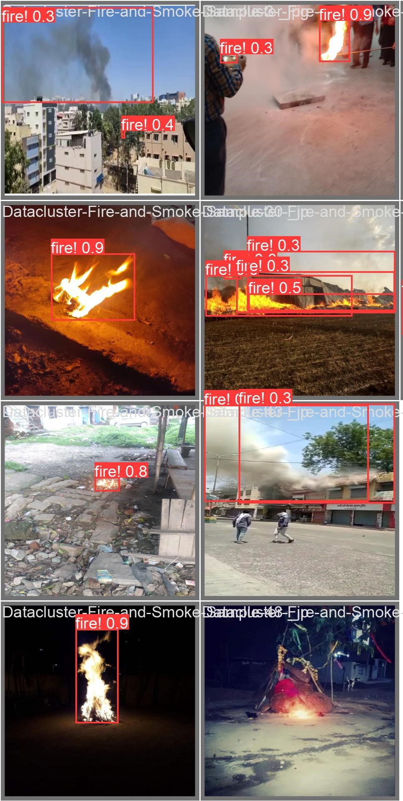

<h1 align="center"><span>Yolov8 Fire Detection</span></h1>


[](https://www.python.org/downloads/release/python-3116/)
[](https://git-scm.com/docs/git/2.39.0)

Fire detection with YOLOv8 is an amazing project aimed at utilizing the powerful YOLOv8 object detection algorithm to detect fires in images or videos. Our repository provides a implementation of fire detection using YOLOv8, including training scripts, pre-trained models, and inference tools.


# Fire Detection With Yolov8

## Installation
Download the face detection repository:
``` shell
# Clone repo
git clone https://github.com/Yusuf-ozen/Yolov8_Fire_Detection.git
```

Navigate to the project directory:
``` shell
cd Yolov8_Fire_Detection
```


Install all necessary library:
``` shell
pip install -r requirements.txt
```


## Testing On Real-Time Webcam
Run this code at git bash or cmd:
``` shell
python yolov8s_live_test.py
```


## Testing on an Image
Run this code at git bash or cmd and change `/path/image` according your files. Using `--resize_width 400` and `--resize_height 400` the size of output image can change:


``` shell
python yolov8s_image_test.py /path/image.jpg --resize_width 400 --resize_height 300
```


## Testing on a Video
Run this code at git bash or cmd and change `/path/image` according your files. Using `--resize_width 400` and `--resize_height 400` the size of output of the video can change:

``` shell
python yolov8s_video_test.py /path/video.mp4 --resize_width 1280 --resize_height 720
```


<br>
<div class="gif">
<p align="center">

</p>
</div>
</div>


## Results
-This results produced after 50 epochs with yolov8s model and [Fire-Dataset](https://www.kaggle.com/datasets/dataclusterlabs/fire-and-smoke-dataset).


| F1 Curve | P Curve | PR Curve |
| :-: | :-: | :-: |
|  |  |  |

| Confusion Matrix | R Curve | results |
| :-: | :-: | :-: |
|  |  |  |


### Predictions

| label | Prediction | 
| :-: | :-: |
|  |  |


## References
https://roboflow.com/

https://github.com/ultralytics/ultralytics

https://github.com/CodingMantras/yolov8-streamlit-detection-tracking/tree/master
